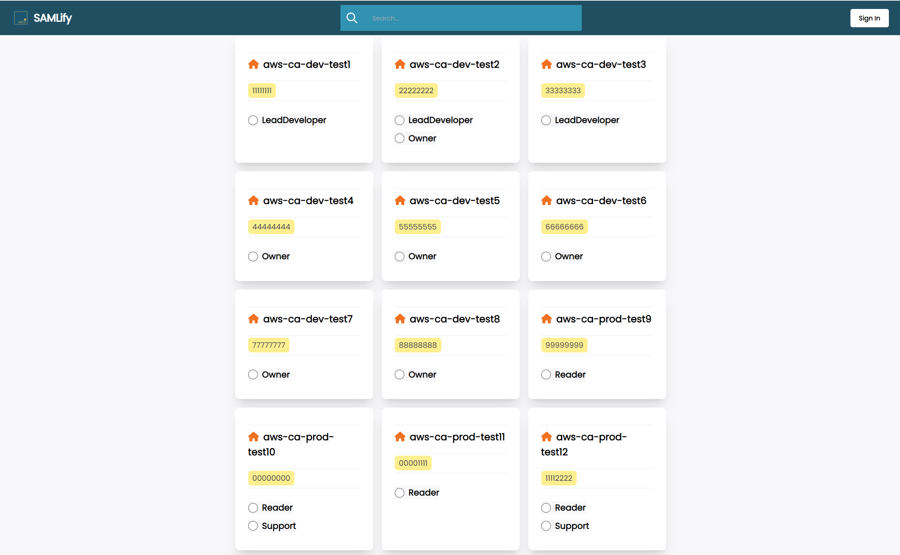

# SAMLify for AWS

A Chrome extension that enhances the AWS SAML login experience for users with multiple accounts and roles.

## Features

- Accounts displayed in sorted order
- Mark accounts as favourites (shown first)
- Copy account ID to clipboard with one click
- Filter accounts using the search bar (auto-focused)
- Sign-in button on each role for quick access

## Installation

### Chrome Web Store
https://chrome.google.com/webstore/detail/samlify-for-aws/nhmhangnpobobcnlfpfblbfkjcoppdng

### From Archive
1. Download or build `SAMLify.zip`
2. Extract to a local folder
3. Open Chrome and navigate to `chrome://extensions/`
4. Enable "Developer mode" (toggle in top right)
5. Click "Load unpacked" and select the extracted folder

## Development

### Prerequisites
- Node.js and npm

### Commands

| Command | Description |
|---------|-------------|
| `npm install` | Install dependencies |
| `npm run build` | Build to `./dist` directory |
| `npm run watch` | Build with watch mode |
| `npm run package` | Build and create `SAMLify.zip` |

### Loading for Development
1. Run `npm run build`
2. Open Chrome and navigate to `chrome://extensions/`
3. Enable "Developer mode"
4. Click "Load unpacked" and select the `dist` folder
